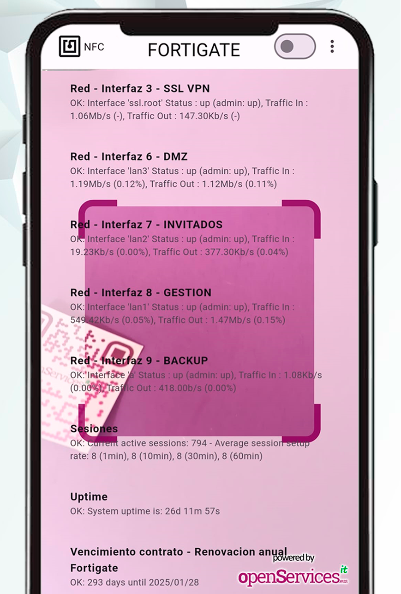

# OSit Monitor

OSit Monitor es una app que funciona en Android y permite escanear códigos QR y etiquetas NFC que tengamos pegados en los elementos core de nuestra organización, sea en servidores, cabinas de almacenamiento, switches, APs Wifi, SAIs... con el objetivo de visualizar en tiempo real sus datos, estado y rendimiento.

OSit Monitor obtiene la información del sistema de monitorización Centreon, por tanto, si dispones de tu infraestructura monitorizada (y eres feliz) podrás bajarte la app y usarla de manera gratuita YA. Es una app de código abierto, no tiene publicidad y viene sin soporte.

## Cómo funciona

Es muy simple, al abrir la app directamente mostrará la cámara del dispositivo móvil (móvil o tablet), con ella escanearemos un código QR que tengamos pegado en un dispositivo monitorizado con Centreon. En el momento de leer el código QR mostrará en pantalla el estado actual todos los _Servicios_ que tiene monitorizados el dispositivo (o _Host_). Y si preferimos escanear una etiqueta NFC, bastará con pulsar el icono del NFC en la app y se quitará la cámara y quedará listo para acercar nuestro dispositivo móvil a la etiqueta NFC y ver los datos en pantalla.

## Qué necesitamos

Podremos usar cualquier generador de códigos QR para las pegatinas, como puedan ser webs que ofrecen dicho servicio gratuito. Al generar los códigos QR, tendremos que tener en cuenta que cada código QR devolverá una palabra únicamente, siendo esta, el nombre de su '_Host_' en Centreon.

Las etiquetas NFC igualmente deberán llevar una cadena de texto con el nombre del '_Host_' de Centreon. Podremos comprar pequeñas etiquetas escribibles NFC por pocos céntimos en Internet, y escribirlas con cualquier app que encontremos en los Stores de Apple o Android.

Si usamos una impresora de pegatinas, podremos imprimir y pegar el QR sobre la etiqueta NFC para tenerlo todo junto.

La versión inicial de OSit Monitor sólo permite conectar a Centreon mediante una conexión MariaDB/MySQL, por tanto, será necesario crear un usuario de lectura en la BD de Centreon y tener conectividad a ella.

## Qué podemos ver

Como indicamos, al escanear un código QR o una etiqueta NFC se mostrarán el estado de todos los ítems monitorizados en dicha máquina. Gracias a Centreon sabemos que podemos conocer la disponibilidad y rendimiento de nuestras máquinas, pues ahora, lo podemos ver en tiempo real y desde cualquier sitio, delante de una antena, de un switch y conocer el estado de sus interfaces, de un hipervisor y conocer su rendimiento, de sus MVs... en una impresora el estado de sus tóner...

Si tenemos alguna alerta en algún _Servicio_ monitorizado en estado Warning o Crítical, éste se visualizará en pantalla en color Amarillo o Rojo respectivamente.

Visualizaremos la dirección IP de la máquina escaneada.

Además campos de texto interesantes como puedan ser el número de serie de la máquina, la fecha de caducidad del contrato de mantenimiento... 

Interesante también la posibilidad de añadir URLs para el acceso con un click a la gestión del dispositivo.

## Ideas de uso

Ítems de ejemplo que podemos monitorizar en Centreon y visualizar con la app OSit Monitor:

*   Servidor: Uso de CPU, memoria, uso de disco, uso de red, estado de procesos, servicios, puertos... métricas de virtualización, estado del hardware,, actualizaciones pendientes del SO...
*   Switch: Uso CPU, memoria, estado y nombre de los puertos, así como su uso de tráfico de red, el estado del hardware...
*   AP Wifi: Uso de canales, experiencia del AP, clientes conectados, versión del firmware, tráfico de red por SSID, VLAN...
*   Firewall: Uso CPU, memoria, sesiones, estado de VPNs, estado, nombre y tráfico de sus interfaces, estado del hardware...
*   Cabina almacenamiento: Uso de CPU, memoria, tráfico de red SAN, volúmenes, estado del hardware, estado de los discos...
*   SAI: Estado y uso de las líneas de entrada/salida, consumos, carga del SAI, estado de carga de las baterías, alarmas...
*   Router: CPU, memoria, nombre y tráfico de sus interfaces, estado del hardware, latencias...
*   Impresora: Estado del hardware, errores en la impresora, uso de la bandeja de papel, estado del tóner, impresiones...
*   Raspberry Pi: Uso de CPU, memoria RAM, disco, tráfico de red, temperatura de la CPU, GPU...
*   Otros: Caducidad de certificados, estado de seguridad SSL, estado de copias de seguridad, SLA que ofrece la máquina, estado de sus BBDD, conocer las vulnerabilidades que tiene...

## Wiki

### Requisitos en Centreon

Como hemos comentado, la versión actual de OSit Monitor conecta directamente al motor de base de datos de Centreon, a una base de datos MySQL o MariaDB, por tanto, será necesario crear un usuario específico en la BD de Centreon, con permisos de lectura únicamente. Lo podremos hacer desde la shell de Centreon, conectando con el comando 'mysql' y las siguientes 2 instrucciones, deberemos indicar un usuario y una contraseña de nuestro interés.

    CREATE USER 'readonly'@'%' IDENTIFIED BY 'CONTRASEÑA';
    grant SELECT ON centreon_storage.* to 'readonly'@'%';

**Nota**: Si sabemos el rango IP o la dirección IP desde donde se van a conectar los dispositivos móviles, se podría indicar para no abrir a todo. En el GRANT en vez de asignar un todo '%', podemos indicar por ejemplo un rango IP con '192.168.33.0/255.255.255.0'.

**Nota 2**: Desconocemos el versionado de Centreon necesario, está validado con una 24.02, entendemos que será compatible con versiones anteriores y futuras.

### Configurar la app

Una vez dispongamos de la app instalada en nuestro teléfono móvil o tablet Android o iOS, podremos configurar la conexión a MySQL/MariaDB desde los 3 puntos en la esquina superior derecha en la opción "DB Params",
 
 

Ahí deberemos establecer la dirección IP (o FQDN) del servidor con la BD de Centreon, el puerto de conexión, así como los credenciales y el nombre de la base de datos.
 
 

En las 'User Preferences', podremos configurarnos un Timeout donde especificaremos el tiempo que queremos que duren los datos en pantalla (en segundos), por defecto 0, ilimitado. Así como la posibilidad de cambiar el color del tema de la app. O muy importante, el tamaño del texto de los resultados que verá en pantalla.
 
 

### Uso de la app

#### Escaneando códigos QR

Como sabemos ya, una de las finalidades de la app será escanear unos códigos QR que nos podremos auto generar y personalizar. Del código QR obtendrá la palabra con el nombre del _Host_ monitorizado en Centreon. Será tan sencillo cómo escanear un QR.
 
 

 

Y nos mostrará inmediatamente, el nombre del _Host_, su dirección IP y el resto de _Servicios_ monitorizados, así como su estado. Bastará con escanear otro código QR y la pantalla se actualizará automáticamente, o, podremos pulsar sobre el nombre del _Host_ en la parte superior izquierda y se limpiará la pantalla.
 
 
Si algún _Servicio_ del _Host_ estuviese en estado Warning o Crítical se visualizaría dicho servicio con otro color. Además, los _Servicios_ que devuelvan una URL nos permitirán pinchar en ellos y abrir el navegador directamente, por ejemplo a su web de gestión.

Tendremos la posibilidad de cambiar el tema claro/oscuro desde el botón superior de la derecha.

En la parte inferior se dispone de 3 botones, uno para cambiar de cámara, otro para pausar la imagen, y el tercero para activar el flash si es que lo necesitamos.

#### Escaneando etiquetas NFC

 

La otra posibilidad que tenemos con la app Osit Monitor es usar la tecnología NFC para acercar una pequeña etiqueta NFC a nuestro teléfono o tablet y poder visualizar en tiempo real los datos monitorizados de ese dispositivo.

Para usar el NFC, pulsaremos en el icono de la esquina superior izquierda con el logo de NFC y se quitará la cámara, ya no podremos usar códigos QR, es el momento de acercar una etiqueta NFC y verlo en pantalla.

#### Video DEMO

Video de demo de una compilación vieja, espero sirva para hacerse una idea.

## FAQ

### Web para generar QR

Por ejemplo se puede usar QRCODEMONKEY: [https://www.qrcode-monkey.com](https://www.qrcode-monkey.com)

Leerá cualquier tipo de diseño de un código QR de formato TEXTO, donde indicaremos el nombre del _Host_ de la máquina monitorizada en Centreon.

### App para escribir en etiquetas NFC

Por ejemplo se puede usar NFC Tools, tanto en Android como en iOS, permite escribir en etiquetas NFC, deberemos escribir un registro con formato texto, con el nombre del _Host_ de la máquina monitorizada en Centreon.

### Cómo genero un Servicio con URL

Se puede crear un _Servicio_ en Centreon que se llame por ejemplo 'Acceso a gestión' que simplemente devuelva una URL, y así podamos pinchar en ella desde la app OSit Monitor con el objetivo de acceder a la gestión del dispositivo desde nuestro Androd.

El _Servicio_ se apoyará de un Comando tan sencillo como la siguiente línea, y cada _Servicio_ que creemos, como Argumento le indicaremos la URL.

    /usr/bin/echo "$ARG1$"

### ¿Es seguro?

Sabemos que en esto de IT no hay nada seguro, así que queda a tu elección, simplemente se ha creado un usuario con permisos de lectura en tu BD de Centreon. 

Los códigos QR no revelan información confidencial, por lo que, si cualquier usuario (que no disponga de la app) escanea un código QR nuestro, mostrarán el nombre del dispositivo exclusivamente; los datos están en la BD.

El uso debe ser local, tu dispositivo móvil se conectará a la BD de Centreon, todo tráfico interno en tu organización, obviamente ni se te ocurra abrir la BD de Centreon a Internet.

### ¿Futuro?

¿Habrán nuevas versiones con nuevas funcionalidades? ¿Habrán nuevas apps que hagan otras cosas molonguis? 
Quién sabe, alguna idea loca queda, pero... _tempus fugit_.

### Licenciamiento

Cómo indicamos OSit Monitor es gratuita y de código abierto, que podrá ser usada por cualquier persona o empresa.

Con una única condición, los proveedores de IT no tienen derecho de usar o modificar el código de la app, ni para su uso particular, ni la de sus clientes; ni por supuesto vender la app o derivados de esta. ;-)

### Descarga desde los sitios oficiales

**Google Play** (Android): https://play.google.com/store/apps/details?id=com.osit.monitorapp \
**App Store** (iOS): https://apps.apple.com/es/app/osit-monitor/id6477788247

### Contacto

Estamos en https://www.openservices.eus
